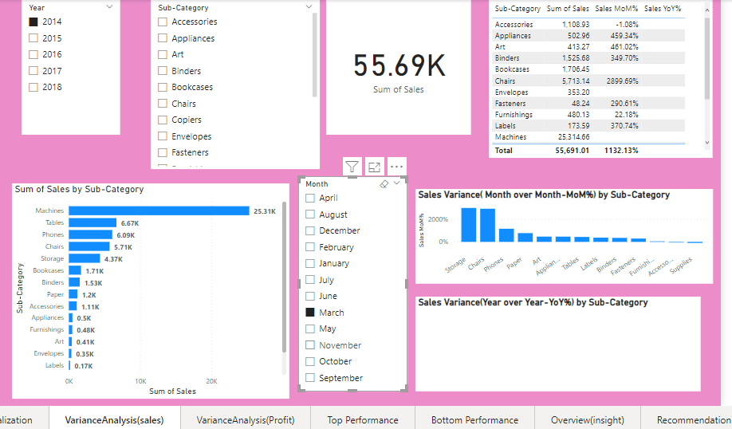

**MIAMI Superstore Transactions Analysis**
***
.jpg)
***
**Introduction**
- This project focuses on using Microsoft PowerBI to conduct sale analysis for a fictional store named " MIAMI Superstore". The primary goal is to analyze  the data and extract valuable insights in order to address essential questions that will enable the store to make informed decisions that's data-driven 
- Disclaimer: Please note that the dataset used and report generated in this context are purely fictional and do not represent any specific company ,country or institution.  They have been solely created for the purpose of demonstrating the capabilities of PowerBI .
- MIAMI store is a fictional store that sells three(3) categories of products:Technology, Furniture and office supplies.
  **Problem Statement**
  ***
1. To identify the Profit margin over the past 5 years(2014-2017)
2.To identify how sales and profit trended on monthly and yearly basis
3.The products sub-category that's most profitable and least profitable
4.To examine the Top 5 and Bottom 5 product performance 
5. Total Sales revenue and Profit generated
6. The total cost incurred for goods / Products availability without the operating expenses
7. The Profit by segment ,category and Region.
**Skills Demonstrated**
***
       1. Data preparation, transformation using Microsoft excel and Power Query Editor (PowerBI)
       2. Data modelling
       3 DAX
       4. Quick measures 
       5 connecting Slicers with the report
       6. Ribbon chart 
       7. Hyperlinks 
       8. Tooltips
       9.Filters
       10. creating a Calendar Table.
       
 **Data sourcing**
 ***
The sample Suoerstore dataset was gotten from Data.World
**Data Transformation**
***
1.The dataset( Transaction Table) was transformed using Power Query Editor (PowerBI) 
2.Three(3) Dimension Tables(Customer, Location ,Product) were formed from the Transaction Table and all the categorized tables were grouped according to related data concept
2. Fact able ( Transaction Table ) was renamed SALESFact
3. Duplicates were removed from the Dimension Tables 

Data modelling

Please note that all the necessary relationship couldn't  be formed  successfully I.e the Product ID could not form a one (1) to many(*)  Relationship because PowerBI needed assurance that the many(*) to many(*) Relationship is valid( can serve its intended purpose) before interpreting it the way it ought to be.

Technique Applied to Solve Barrier Encountered 
I examined the dataset( Transaction Table ) from the  secondary source (where I imported the file from I.e Microsoft excel) in order to verify if any many(*) to many (*) Relationship was formed in any of the data category I.e the dimension tables . I realized the Product ID and Product Name fields/columns
contained duplicated values respectively and since the Product ID and Product Name are under the same data category,  i merged both of them to form a unique identifier (Primary key;Product key ) for the product category then merged the two columns(Product ID and Product Name) accordingly to form the same Primary key;
Product key for the Fact Table(SALESFact) .
I removed both the Product ID and Product Name columns from the Fact Table after merging to form Product Key

Put the necessary images that's is related here

Data modelling image here 
 The structure of the data follows a star schema design consisting of three(3) Dimension Tables (Customer, Location and Product) and one Fact Table (SALESFact). The dimension tables are connected  to the Fact Table through a one(1) to many(*)
Relationship. 

Visualization image here 

measured created images here
**Variance analysis**
***

Top Performance chart ( sales and profit)
talk about the items 

Bottom Performance chart

Conclusion

Recommendations

Link to PowerBI service
one drive Google drive for the Pbix file 
