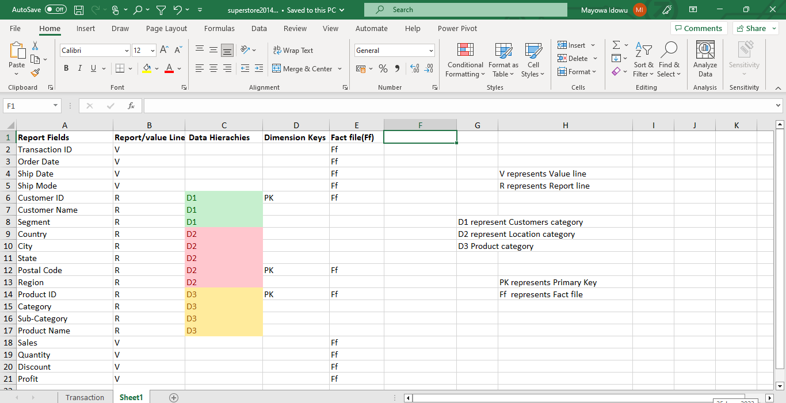
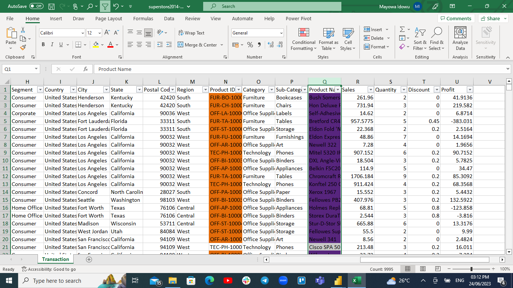
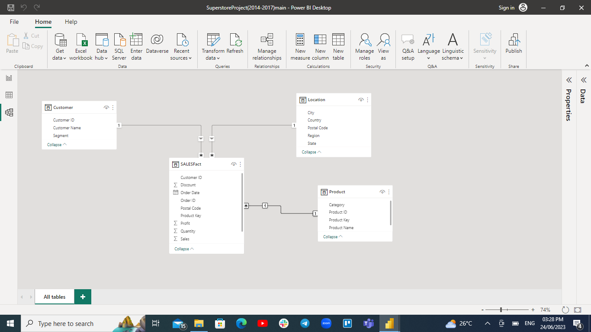
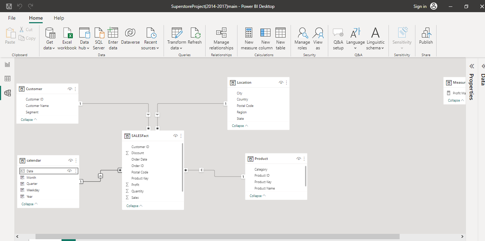
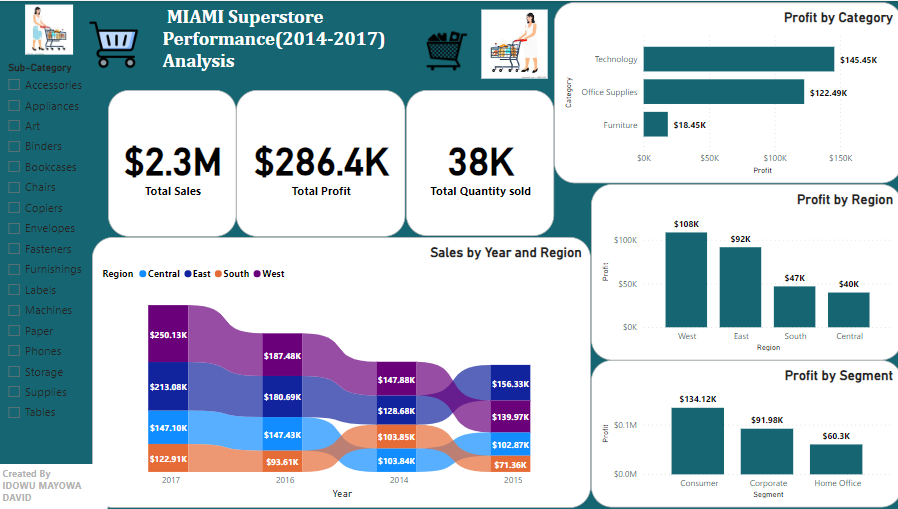
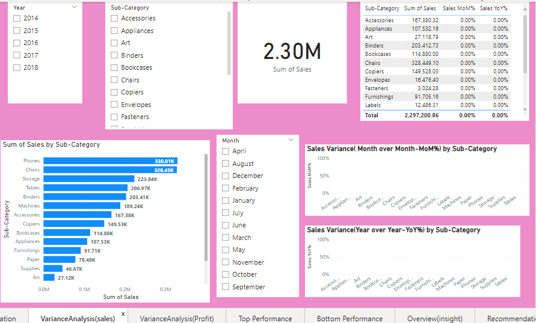
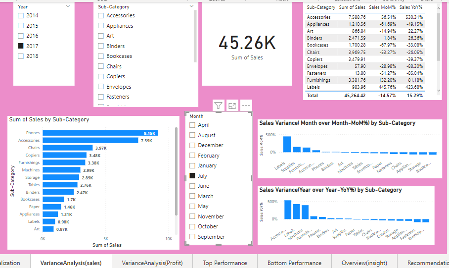
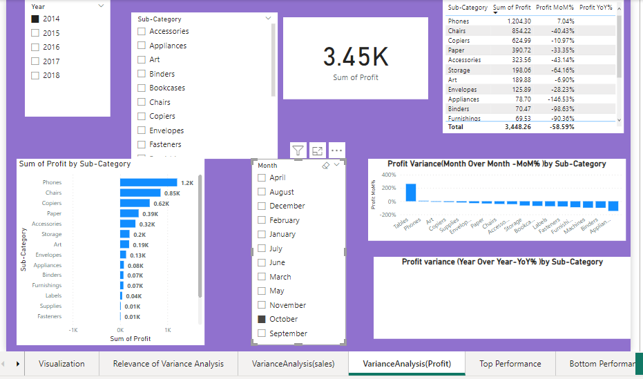
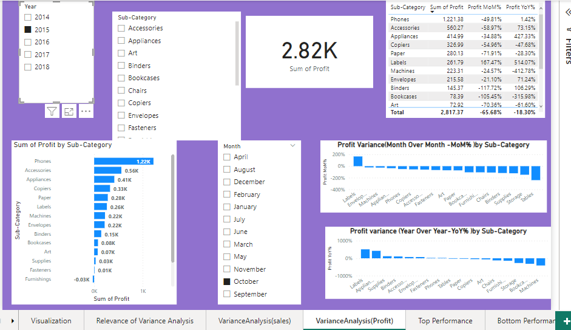
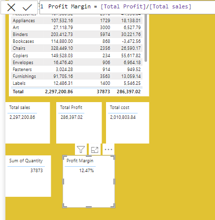

**MIAMI SUPERSTORE PERFORMANCE ANALYSIS**
***

***
**Introduction**
- This project focuses on using Microsoft PowerBI to conduct sale analysis for a fictional store named " MIAMI Superstore" that's located in USA. The primary goal is to analyze  the data and extract valuable insights in order to address essential questions that will enable the store management team to make informed decisions that's data-driven.
-  
  _Disclaimer_: _Please note that the image used above likewise the dataset  is a sample  and the report generated in this context are purely fictional I.e they do not represent any specific store, company ,country or institution.  They have been solely created for the purpose of demonstrating my problem solving skill with a Business intelligence Tool(visuals/chart ,DAX knowledge implementation) &  PowerBI capabilities ._
- MIAMI store is a store that sells three(3) categories of products:Technology, Furniture and office supplies.
***
**Problem Statement**
***
1. To identify the Profit margin over the past 5 years(2014-2017).
2. To identify how sales and profit trended on monthly and yearly basis.
3. To identify the product sub-category that's most profitable and least profitable.
4. To examine the Top 5 and Bottom 5 product performance .
5. Total Sales revenue and Profit generated.
6. The total cost incurred for goods / Products availability without the operating expenses
7. The Profit by segment ,category and Region.
***
**Tools Used**
***
  - Microsoft excel
  - Power Query Editor on PowerBI
  - Microsoft PowerBI 
***
**Skills Demonstrated**
***
- Data preparation, transformation using Microsoft excel and Power Query Editor (PowerBI)
- Data modelling
- DAX
- Exploratory Data analysis (EDA)
- Quick measures 
- Connecting Slicers chart with the report.
- Ribbon chart usage.
- Hyperlinks 
- Tooltips
- Filters
- Creating a Calendar Table.
***     
**Data sourcing**
***
 The sample Superstore dataset was gotten from data.world( https://data.world/datasets/open-data)
***
**Data Transformation**
***
1. The dataset( Transaction Table) was transformed using Power Query Editor (PowerBI). 
2. Three(3) Dimension Tables(Customer, Location ,Product) were formed from the Transaction Table and categorized  according to related data concept.
3. Fact table ( Transaction Table ) was renamed SALESFact.
3. Duplicates were removed from the Dimension Tables .

***
**Data modelling**
***
 - Please note that all the necessary relationship could not  be formed  successfully ;the Product ID could not form a one (1) to many (*)  relationship because PowerBI needed assurance that the many (*) to many(*) relationship is valid( can serve its intended purpose) before interpreting it the way it ought to be.
***
**Technique Applied to Solve the Barrier Encountered**
***
 - I examined the dataset( Transaction Table ) from the  secondary source (the excel file on excel workbook) in order to verify if any many(*) to many (*) relationship was formed  within the dimension tables that was categorized.
 - I realized the Product ID and Product Name fields/columns contained duplicated values respectively and since the Product ID and Product Name are under the same data category,  i merged both of them to form a unique identifier (Primary key;Product key ) for the product category then merged the two columns(Product ID and Product Name) accordingly to form the same Primary key; Product key for the Fact Table(SALESFact) .
- I removed both  Product ID and Product Name columns from the Fact Table after merging to form Product Key.
 PowerBI Prompt seeking validity of Many-to-Many relationship
  :--------------------------------------:
  
  
Conditional formating on Product(ID&Name) to reveal Duplicated values and examine  many-to-many relationship)
:----------------------------------------------:

**Required Relationship after Generating Primary key(Product key)**

Star-schema model design
:----------------------------------------------:

- The structure of the data follows a star schema design consisting of three(3) Dimension Tables (Customer, Location and Product) and one Fact Table (SALESFact).
-  The dimension tables are connected  to the Fact Table through a one(1) to many(*)
relationship.
***
**Visualization**
***

***
**Variance( Difference in Sales & Profit) Analysis**
***
  This report should help the Superstore management team have a mind blueprint to evaluate and get answers to the following questions:
- Which products have impressive  profitable Performance ?
- How will the trends suit planning and budget allocation with time?
- Are the the Pricing and Promotion really effective?
- How can the Performance Benchmarking be determined?
- Which  areas are showing inefficiencies?
- What are the factors influencing the sales and Profit Variance?.
 
  The images below represent the variance(Sales and Profit) according to periods( Month over Month ,Year over Year I.e monthly and yearly basis respectively for Sales and Profit;
  
**Sales Variance(Monthly and Yearly)**
:-----------------:

- _The image Above Represents Sales Variance(Monthly and Yearly) with no  Slicer chart connection_
  

**Profit Variance(Monthly and Yearly)**
:--------------:

- _The image Above Represents Profit Variance(Monthly and Yearly) with no Slicer chart connection_  

***
**Top Performance charts**
***

- Technology  category( Phone) is the most Profitable product ,it generated close to 45% of the Total profit 
- The Paper(23.79%) and Binders(21.12%) implies the office equipment generate an impressive quota of the profits likewise the storage equipment(14.87%) and Furnishing equipment (9.12%).
***
**Bottom Performance charts**
***

***
**Conclusion**
***
   Overview
:-------------:

_A profit margin of 12.47 % or 0.1247 over 5years of transactions in the superstore means that for every $100 in sales revenue ,the store generates a profit of $12.47_.

Even though the best way to determine whether a Profit margin is good or bad is to compare it to the average profit margin for your industry and size of business(Here are some examples of average profit margins for different industries;
- Retail : 3-5%
- Manufacturing: 5-10%
- Technology: 10%
- HealthCare: 15% ).
  
Furthermore, going by the general rule of thumb, a 10% net profit margin should be considered average why a 20% net profit margin should be considered high/good enough and a 5% net profit margin is low.

With respect to the cost of production/ availability of goods($2,010,803.84 million) incurred in the store over 5years ,it implies that the profit that's being generated is average and not really encouraging considering other crucial factors such as operating expenses like store maintenance(wages to staff, running of facilities), advertisement, Tax etc .. that will executed regardless. 
***
**Recommendations**
***

1. Products with Top Sales & Profit in the West and Eastern part of the Country(USA) have shown a wide gap margin compared to the southern and central region hence they should be the target goods/products and realistic, strategic plans should be made to ensure such products are always available in large quantities(check the Top performance page to chart).

2. By using a Social media content creator to leverage on popular social media platforms, more advertisement should be done in every region in the country to create more awareness about the goods / services rendered in the Superstore in order to keep improving the sales for products with poor consumptions.

3. Customer service(virtual and physical ) agents should be made available to help customers provide answers to enquiries.

4. Real time Digital tools for Product demonstrations like a pre- recorded video accessible on screen and on repetiton should be made available on-site to help customers learn more about the product and how to use them.

5. Discounted Sales should be done occasionally for products with the least consumptions in order to encourage the customers. 

6. More Delivery equipment should be made available as well as occasionally discounted rate delivery .

7. Gift Wrapping; This is a great way to add a touch of luxury to your store . You can offer gift wrapping services for free or at a small fee.
   
 Conclusively, the recommendations provided in this report offer a roadmap for improving sales and profit performance and enhancing overall financial success.

Link to Dashbord on PowerBI service here https://app.powerbi.com/links/kVCQFi4-ef?ctid=72c2caba-4a2b-434c-80dd-759bc088d6db&pbi_source=linkShare)

Google drive link to download  complete Report Pbix file  here( https://drive.google.com/file/d/1QbP-vQIm13ErzMY9YT0pL2kpwmvXoXag/view?usp=sharing)
